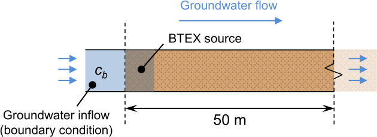
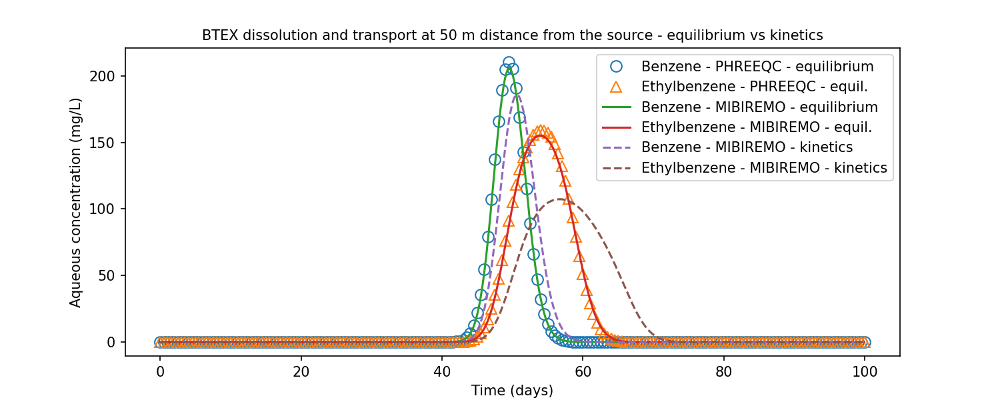
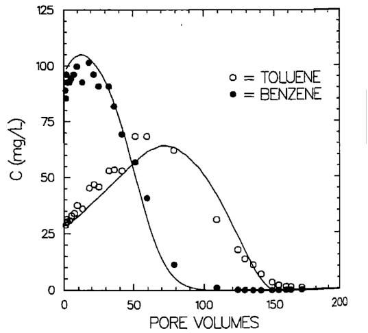

# MiBiReMo - Examples

Nine examples are available as both Python scripts and Jupyter notebooks.
To run the examples as scripts, navigate to the `examples` directory and run the desired example:
```sh
cd examples
python phreeqcrm_calcite_titration.py
```

Interactive Jupyter notebooks are also available in the `examples` folder, and can be viewed in the [Tutorial Notebooks](notebooks/phreeqcrm_calcite_titration.ipynb) section.

The field model examples and `validation_field_vs_mibitrans.py` need MODFLOW 6 and its shared library (`get-modflow :python --subset mf6,libmf6`).

## PhreeqcRM models
These examples use the classes `PhreeqcRM` and `SemiLagSolver` directly.

### Titration
The example `phreeqcrm_calcite_titration.py` demonstrates the use of the package to simulate a simple titration in a batch, where a solution is equilibrated with a mineral phase (calcite) and the pH is adjusted by adding HCl.

### Benzene and Ethylbenzene kinetic dissolution
The example `phreeqcrm_BTEX_dissolution.py` demonstrates the use of the package to simulate the kinetic dissolution of benzene and ethylbenzene in a batch reactor.

### Reactive transport - BTEX dissolution and transport
The example `phreeqcrm_BTEX_transport_coupling.py` demonstrates the use of the package to simulate the reactive transport of benzene and ethylbenzene in a 1D domain.
The problem is described in the following scheme:



The model consists of a 1D domain with a length of 100 m. The domain is initially filled with clean groundwater with a spot of benzene and ethylbenzene pure phases present at the left side of the domain extending for 0.5 m. We assumed that the contaminant pure phase in the source zone is immobile (it only dissolves).
The groundwater flows from left to right with a velocity of 1 m/d, and dissolved benzene and ethylbenzene are transported towards the right end of the domain. The dissolution process is modelled both kinetically and equilibrium-based. 
The model is run for 100 days, and the concentration of benzene and ethylbenzene is monitored at 50 m from the inlet.

Three simulation runs are performed:
1. Equilibrium dissolution of benzene and ethylbenzene simulated with PHREEQC (standalone).
2. Equilibrium dissolution of benzene and ethylbenzene simulated by MiBiReMo (1D transport solver coupled with PhreeqcRM).
3. Kinetic dissolution of benzene and ethylbenzene simulated by MiBiReMo.

The transport equition (advection and dispersion) in MiBiReMo is solved using a Semi-Lagrangian scheme with operator splitting, where the advection is solved using the method of characteristics with cubic spline interpolation, and the dispersion is solved using the Saul'yev finite differences technique. 

Simulation results are shown in the following figure:



The results obtaines show a pattern similar to the experimental results obtained by Geller and Hunt (1993) [[1]](#1).
In their experiment they injected an equimolar mixture of benzene and toluene in the center of a column which was subsequently eluted with water. The results show that benzene is eluted first, followed by toluene because of the different solubilities.
The following figure shows the experimental results obtained by Geller and Hunt (1993):




## Field model
These examples use `FieldModel`. See [Field model](field_model.md) for the conventions of the model.

### Tracer test
The example `field_tracer_test.py` builds a MODFLOW 6 model of an in situ biological flushing installation with `FieldModel`: one extraction well and four injection wells around it in a confined aquifer with groundwater flow. A tracer is injected during the first day. The example shows the hydraulic head and drawdown, the tracer plume, and the breakthrough and recovery at the extraction well.

### Injection-extraction distance
The example `field_injection_extraction_distance.py` repeats the tracer test of `field_tracer_test.py` with the injection wells at 4 m, 6 m, and 10 m from the extraction well, and compares the breakthrough curves and the tracer mass recovery at the extraction well.

### Layered aquifer
The example `field_layered_model.py` repeats the tracer test of `field_tracer_test.py` in a layered aquifer made of three hydrostratigraphic units, with a sloping top and a general-head boundary, and compares it with a homogeneous single-layer aquifer of the same transmissivity. The example shows the hydrostratigraphic units and the tracer in cross sections, and the breakthrough at the extraction well and at a monitoring well with two sampling levels.

## Column model
These examples use `ColumnModel`. See [Column model](column_model.md) for the conventions of the model.

### Laboratory column test
The example `column_reactive_transport_test.py` simulates a laboratory column with `ColumnModel`: a soil column flushed with a solution containing a conservative tracer and a solute degraded with first-order kinetics, with a flow interruption (stop-flow test). The example shows the breakthrough curves in time and in pore volumes flushed, and the concentration profiles in the column.

## Numerical validation
These examples compare the models with the exact analytical solution of [mibitrans](https://github.com/MiBiPreT/mibitrans) (Wexler, 1992) [[2]](#2), for a conservative tracer and for a solute with first-order decay (a PHREEQC KINETICS reactant).

### Column model vs mibitrans
The example `validation_column_vs_mibitrans.py` validates `ColumnModel` against the analytical solution in its one-dimensional limit: the column of `column_reactive_transport_test.py`, flushed with a constant influent concentration. The example compares the concentration profiles in the column and the breakthrough curves at the outlet.

### Field model vs mibitrans
The example `validation_field_vs_mibitrans.py` validates the transport and the PHREEQC coupling of `FieldModel(phreeqc_coupling=True)`, which couples MODFLOW 6 and PHREEQC through mf6rtm. The plume from a constant-concentration source in uniform flow is compared with the analytical solution.


## References

<a id="1">[1]</a> Geller, J. T., and J. R. Hunt (1993), Mass transfer from nonaqueous phase organic liquids in water-saturated porous media, Water Resour. Res., 29(4), 833–845, doi:[10.1029/92WR02581](https://doi.org/10.1029/92WR02581).

<a id="2">[2]</a> Wexler, E. J. (1992), Analytical solutions for one-, two-, and three-dimensional solute transport in ground-water systems with uniform flow, U.S. Geological Survey Techniques of Water-Resources Investigations, Book 3, Chapter B7, doi:[10.3133/twri03B7](https://doi.org/10.3133/twri03B7).
